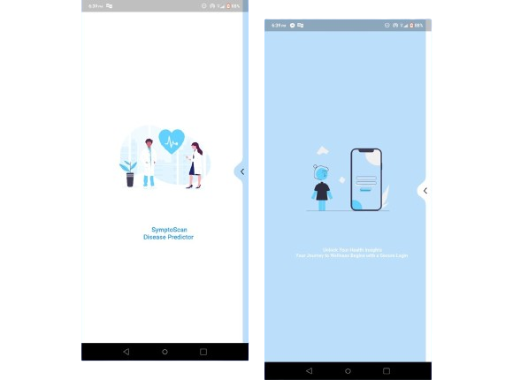
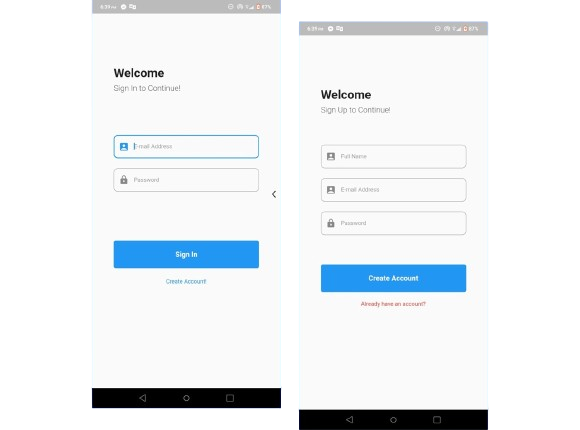
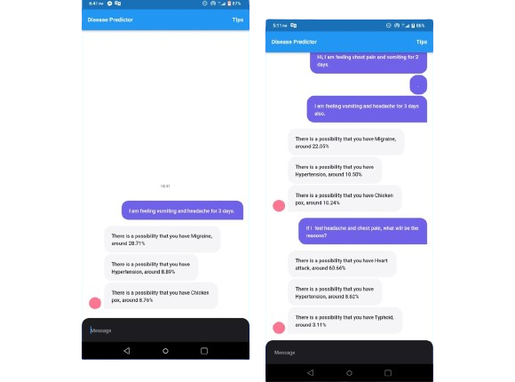
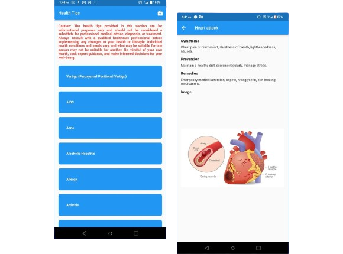

# SymptoScan
Empowering Your Health Journey with Predictive Insights and Informed Wellness Choices.
- Website Link: https://sympto-scan-website.vercel.app/
- Application Project Link: https://github.com/RJ-Hossan/SymptoScan_Disease_Suggesting_App

## Table of Contents
1. [Introduction](#1-introduction)
   1.1 [Motivation](#11-motivation)
   1.2 [Applications and Impacts](#12-applications-and-impacts)
2. [Project Overview](#2-project-overview)
3. [Required Technologies](#3-required-technologies)
4. [System Implementation](#4-system-implementation)
5. [Conclusion](#5-conclusion)
6. [Future Recommendations](#6-future-recommendations)
7. [References](#7-references)

## 1. Introduction
The rapid advancements in machine learning have opened new doors for transforming healthcare, 
particularly in the domain of disease prediction or suggestion. Therefore, in the ever-evolving 
landscape of digital healthcare services, our project “SymptoScan” will emerge as a 
groundbreaking application, seamlessly connecting together the realms of artificial intelligence 
and preventive healthcare. This report intended to represent the background motivation, 
applications, system implementation as well as impacts of the app in the landscape of digital 
healthcare services. Far more than a mere application, “SymptoScan” is an embodiment of a 
visionary approach to healthcare-one that seamlessly integrates cutting-edge technology with a 
deep-seated commitment to preventive well-being. The app does not just hand out predictions; it 
arms users with knowledge through the health tips section which will create a community where 
individuals are not passive recipients but active architect of their own health future. The vision 
extends beyond the blockade of an application, it is a manifesto for a future where health is not 
just a condition but a dynamic, self-directed journey.

### 1.1 Motivation
The creation of “SymptoScan” is rooted in a profound recognition of the systemic gaps and 
challenges emerged within conventional healthcare services. The motivation that propelled the 
deployment of the app are multi-faceted, evolving from a commitment to addressing pressing 
issues as well as revolutionizing the way we perceive and take care our health. The major 
motivations behind the genesis of this app are as follows-

- The realization that traditional healthcare system often finds itself entangled in the web 
of delayed diagnoses as well as critical illnesses are identified at the last stages, where 
there are no ways to prevent the illnesses.

- The realization of a commitment to democratizing access to predictive healthcare tools. 
Health disparities are huge, and the ability access cutting-edge health technologies should 
not be dependent on geographical location or socioeconomic status.

- To foster a culture of preventive healthcare by shifting narrative from illness management 
to proactive health maintenance.

- Utilization of technologies specifically machine learning in healthcare services which will 
be trademark for further improvements.

### 1.2 Applications and Impacts 
The app’s significance extends far beyond the realms of conventional health applications. Its 
diverse applications and potential impacts through the domains of disease prediction, health 
education as well as social being.

- SymptoScan employs a sophisticated machine learning model to predict 41 types of 
diseases [1]. Users input relevant health data, and the model, through data analysis and 
pattern recognition, predicts the degree of accuracy of being a disease. The primary impacts 
here is early disease detection. By predicting diseases at early stage, the app provides users 
with a crucial door for preventive measures as well as early medications which can 
significantly improve health outcomes, reduce treatment costs, and enhance overall 
healthcare efficiency.

- The health tips section serves as an information hub, providing users with comprehensive 
details about various diseases. This includes symptoms, preventive measure as well as 
recommended lifestyle changes. The educational aspect contributes to a more healthconscious society and promotes proactive health management.

- SymptoScan’s societal impact is broad, ranging from individual well-being to communitybased health. By democratizing access to early detection and health education, it addresses 
healthcare disparities.

## 2. Project Overview
The development of “SymptoScan” was a careful task, spanning from the conceptualization of its machine learning model to its user interface. The project overview delves into key aspects and features of the app.

- **Machine Learning Model:** The core of “SymptoScan” lies in its machine learning model, meticulously trained to predict 41 types of diseases.

- **Disease Suggestion Section:** Users are able to input their symptoms and health information into the app, which will then utilize a machine learning model to provide predictions about potential diseases.

- **Health Education Section:** The app features comprehensive information on diseases, including information about symptoms, risk factors, prevention strategies, and available treatments.

- **User-Friendly Interface:** The user interfaces are designed with a focus on simplicity and clarity, allowing users to navigate the app with ease including authentication-based login and signup section.

## 3. Required Technologies
- **Development Platforms:** Android Studio and Visual Studio Code
- **Frontend Development:** Flutter
- **Database:** Firebase
- **Model Deployment:** Hugging Face Transformers

## 4. System Implementation
The system implementation portion intends to represent some samples of the implemented app “SymptoScan”.

Figure 1: Splash Screens

Figure 2: Login and SignUp Screens

Figure 3: Disease Prediction Screens*

Figure 4: Health Tips Screens*

## 5. Conclusion
SymptoScan marks the culmination of a visionary journey in redefining healthcare dynamics. The successful implementation of this app not only showcases the power of machine learning in predicting diseases but underscores our commitment to fostering a culture of proactive health management.

## 6. Future Recommendations
Though this app marks a visionary journey in digital healthcare services, it has some limitations as well which can be addressed in the future. Some recommendations for future improvements include:

- Implementation of a comprehensive user profile section.
- Introducing a symptom tracking system.
- Establishing a system for users to provide feedback.
- Regularly updating the health tips section.

## 7. References
1. The multiple diseases prediction model "symps_disease_bert_v3_c41" by shanover [Hugging Face](https://huggingface.co/shanover/symps_disease_bert_v3_c41).
